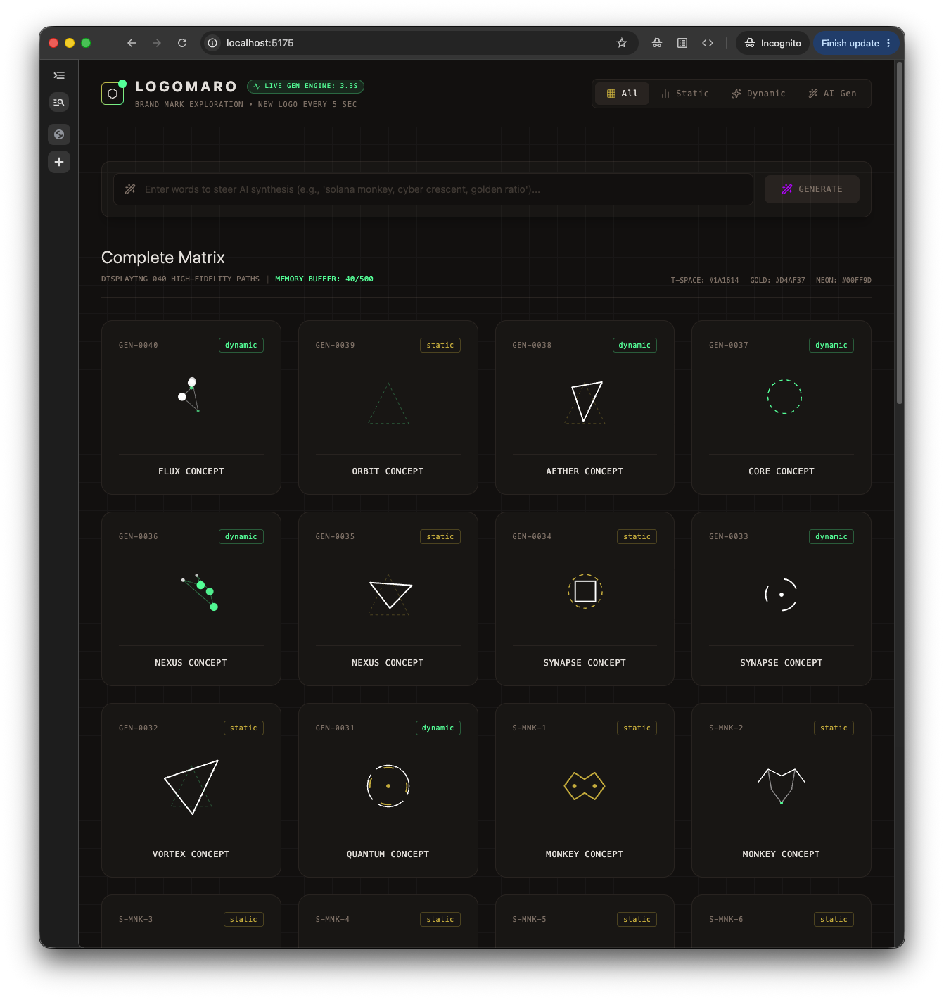

# Logomaro

Generate institutional-grade geometric abstract SVG marks for DeFi and Web3 brands instantly via hand-crafted vectors, local procedural randomness, or natural language AI synthesis.



Logomaro is a lightweight, high-performance logo exploration engine designed specifically for developers and Web3 builders who need clean, scalable, geometric brand assets. By combining hand-crafted SVG geometry with a local procedural generator and Puter.js AI synthesis, it eliminates the need for expensive design agencies or complex vector editing software when spinning up new dApps or protocols.

## Features

- **Puter.js AI Synthesis** — Describe a concept in natural language and receive clean, production-ready SVG code dynamically.
- **Procedural Engine** — Explore a new random geometric SVG composition generated locally every 5 seconds.
- **Hand-Crafted Vector Library** — Includes 30 custom geometric marks (20 static, 10 animated with Framer Motion).
- **Instant SVG Access** — Click to copy clean SVG code directly to your clipboard from a high-density, filterable explorer grid.
- **Continuous Memory Buffer** — View, pause, play, and search up to 500 generated iterations in a persistent viewport.

## Getting Started

```bash
# Install dependencies
pnpm install

# Start the local development server
pnpm dev

# Run Vitest suite
pnpm test:run

# Verify TypeScript compilation
pnpm typecheck

# Build optimized production bundle
pnpm build
```

- **License:** MIT
